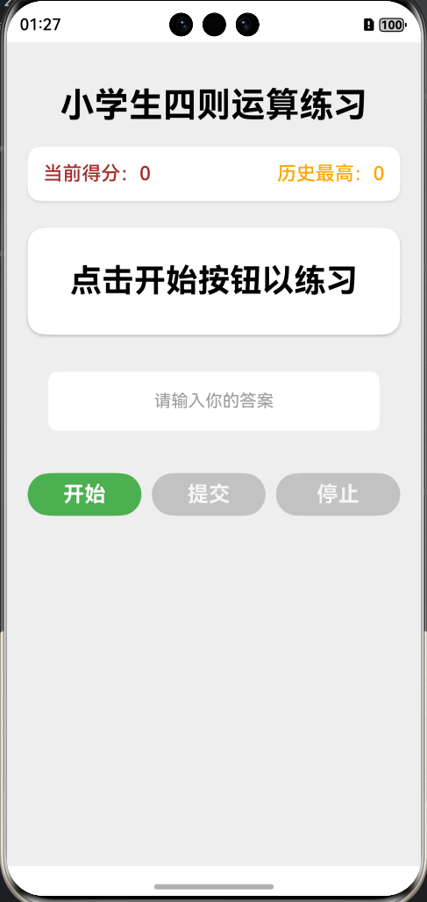
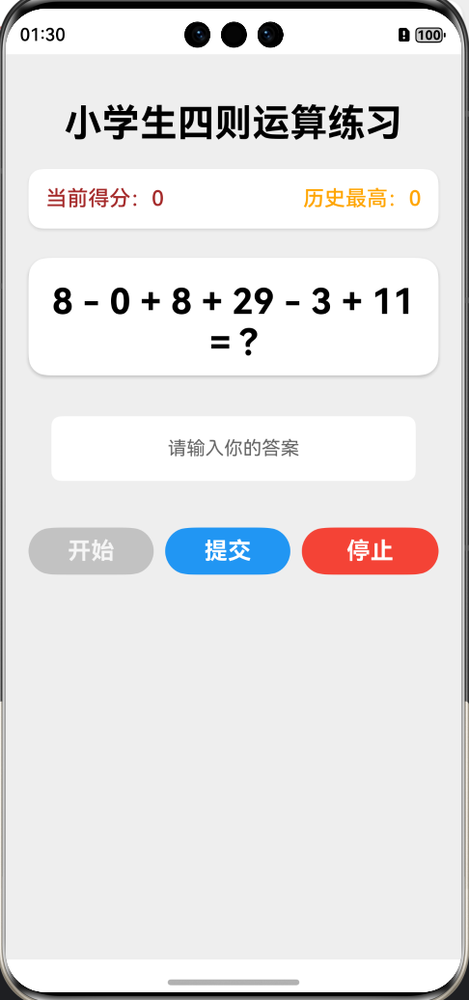
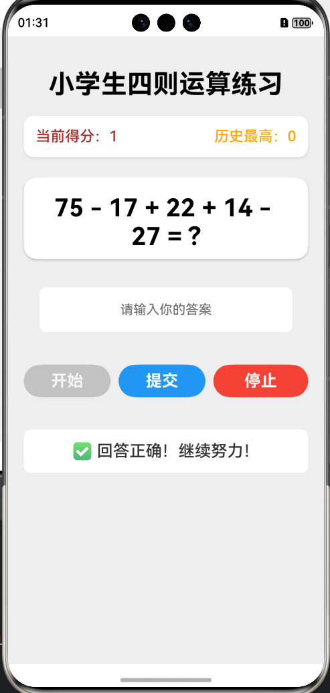
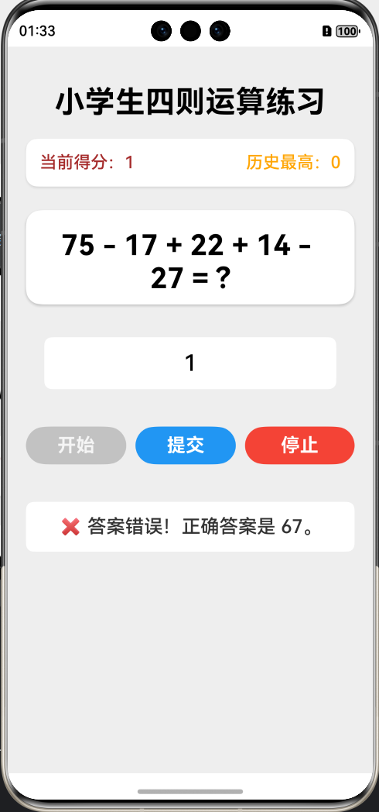
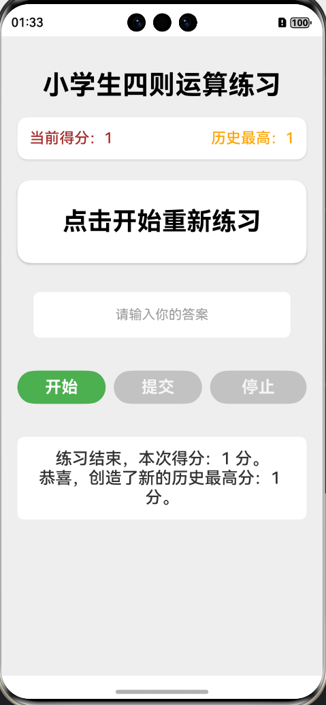

# 小学生四则运算练习 APP 设计说明文档

本项目是一个辅助小学生进行四则运算练习的 APP，目前支持`+`、`-`、`*`三种运算符。

## 应用架构说明

本项目采用了 HarmonyOS Service-View 分离的架构模式进行开发，将复杂的逻辑从界面层中抽离，提高代码的清晰度。

应用由三个主要模块组成：

| 模块名称    | 文件名                                                  | 职责描述                                                    |
|---------|------------------------------------------------------|---------------------------------------------------------|
| View    | `./entry/src/main/ets/pages/Index.ets`               | 负责 UI 界面的构建和渲染，监听 Service 层的数据变化并响应式更新。同时，它负责接收用户的输入事件。 |
| Service | `./entry/src/main/ets/service/ArithmeticService.ets` | 核心逻辑层。管理游戏状态、当前得分、历史最高分。负责题目的生成、用户答案的验证，以及游戏流程的控制。      |
| Utility | `./entry/src/main/ets/service/Parser.ets`            | 表达式求值工具。负责对随机生成的数学表达式字符串进行解析和计算，采用递归下降算法。               |

## 核心功能实现思路

### 题目生成功能

* 随机表达式构建
  * 操作数和运算符数量确定：随机确定运算符的数量在3到5个之间。
  * 数值范围控制：加减法右操作数限制在0-30之间，乘法右操作数限制在2-9之间，符合小学阶段的运算难度。
  * 非负数保障：为了确保结果为非负整数，在进行减法运算时，代码会进行前置判断：只有当当前值大于或等于下一个操作数时，才允许进行减法操作。
  * 运算复杂度控制：
    * 通过`usedOps`集合跟踪已使用的运算符，并尝试在生成过程中引入至少两种不同的运算符，确保题目的多样性。
    * 如果最终结果超出0到100的范围（或出现负数），则重新生成题目，确保题目有效。
* 表达式求值
  * 采用递归下降算法

### 答题与验证功能

* 答案提交与验证
  * 输入处理：首先对用户输入进行非空和有效数字检查。
  * 校验逻辑：将用户输入的数字与`Service`层存储的正确答案进行严格比较。
  * 结果反馈与流程控制：
    * 正确：`currentScore`加1，显示“回答正确”信息，并立即调用`generateQuestion()`生成下一道题目。
    * 错误：显示“答案错误”信息和正确的答案，并在1.5秒后自动调用`endGame()`结束本次练习。
* 游戏控制
  * 开始：重置`currentScore`为0，设置`isGameActive = true`，并立即生成第一道题。
  * 停止：允许用户随时中断游戏，调用`endGame()`统计当前成绩。
* 得分统计功能
  * 实时得分：`currentScore`状态在每次回答正确后实时更新，并通过`ScoreBoard()`模块实时显示在界面上。
  * 历史最高分：`highScore`状态用于记录历史最高成绩。
  * 游戏结算：
    * 在游戏结束时，将本次得分与`highScore`进行比较。
    * 如果大于`highScore`，则更新`highScore`，并提示用户“创造了新的历史最高分”。
    * 最终显示本次得分和最新的历史最高分，满足了所有的得分统计要求。

## 程序运行截图

初始状态

点击开始按钮

回答正确

回答错误

